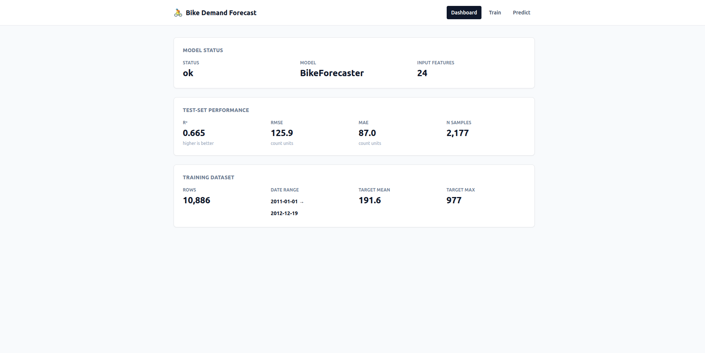

# 🚲 PyTorch 자전거 수요 예측 (Full-Stack)

PyTorch 기반 딥러닝 모델(MLP / LSTM)로 자전거 공유 수요를 예측하는 **풀스택 웹 애플리케이션**입니다. FastAPI 백엔드에서 학습·추론을 제공하고, React 프런트엔드에서 데이터셋 업로드·실시간 학습 모니터링·단일 예측을 수행합니다.


<p align="center">
  
  <br />
  <sub><i>대시보드 · 실시간 학습 모니터링 · 단일 예측 UI</i></sub>
</p>

---

## 📑 목차

- [주요 기능](#-주요-기능)
- [아키텍처 개요](#-아키텍처-개요)
- [기술 스택](#-기술-스택)
- [프로젝트 구조](#-프로젝트-구조)
- [빠른 시작](#-빠른-시작)
- [API 레퍼런스](#-api-레퍼런스)
- [데이터 형식](#-데이터-형식)
- [모델 아키텍처](#-모델-아키텍처)
- [설정 파일](#-설정-파일)
- [오프라인 CLI 워크플로우](#-오프라인-cli-워크플로우)
- [문서](#-문서)
- [문제 해결](#-문제-해결)
- [라이선스](#-라이선스)

---

## ✨ 주요 기능

### 🎛️ 웹 인터페이스
- **대시보드**: 모델 로드 상태, 최신 지표(R²/RMSE/MAE), 활성 데이터셋 요약을 한눈에
- **학습 페이지**: CSV 업로드 → 모델·에폭·배치 크기·학습률 설정 → 학습 시작/취소
- **실시간 학습 곡선**: Server-Sent Events(SSE)로 epoch 단위 loss 스트리밍, Recharts로 시각화
- **예측 페이지**: 단일 샘플 폼 입력으로 즉시 추론 결과 확인

### 🤖 딥러닝 모델
- **MLP**: 4층 완전연결망(512→256→128→64) + BatchNorm + Dropout
- **LSTM**: 2층 LSTM(hidden=128) + FC 헤드, 시계열 패턴 학습
- **AMP 학습**: CUDA 사용 시 자동 혼합 정밀도로 가속
- **Early Stopping**: `ReduceLROnPlateau` + patience 기반 자동 종료
- **협조적 취소**: 학습 중 언제든 안전하게 중단 가능

### 🛠 데이터 파이프라인
- **24개 자동 엔지니어링 피처**: 순환 인코딩(sin/cos), 러시아워/주말 플래그, 상호작용 항
- **시계열 분할**: 셔플 없는 chronological train/val/test split
- **Scaler 사이드카**: `preprocessor.joblib`로 학습/추론 전처리 완전 동기화
- **CSV 스키마 검증**: 업로드 시 필수 컬럼·타입 자동 체크

---

## 🏗 아키텍처 개요

```
┌──────────────────────────────┐         ┌─────────────────────────────────┐
│       브라우저 (React)        │  REST   │       FastAPI (Uvicorn)         │
│                              │ ◀─────▶ │                                 │
│  HomePage / TrainingPage /   │   SSE   │  routers: datasets, training    │
│  PredictPage                 │ ◀────── │  services: training(thread)     │
│  TanStack Query + EventSource│         │  core ML: BikeForecaster/LSTM   │
└──────────────────────────────┘         └──────────────┬──────────────────┘
                                                        │
                                                        ▼
                                      ┌─────────────────────────────────────┐
                                      │ outputs/                            │
                                      │ ├─ uploads/*.csv                    │
                                      │ ├─ models/*.pth + preprocessor.joblib│
                                      │ └─ predictions/*.json               │
                                      └─────────────────────────────────────┘
```

자세한 구조와 UML은 [docs/ARCHITECTURE.md](docs/ARCHITECTURE.md) · [docs/UML.md](docs/UML.md) 참조.

---

## 🧩 기술 스택

### Backend
| 영역 | 스택 |
|---|---|
| 언어 / 런타임 | Python 3.10+ |
| 웹 프레임워크 | FastAPI, Uvicorn, sse-starlette, python-multipart |
| 딥러닝 | PyTorch 2.x (CUDA 선택) |
| 데이터 | NumPy, pandas, scikit-learn (StandardScaler) |
| 영속화 | joblib (preprocessor sidecar) |
| 설정 | PyYAML |

### Frontend
| 영역 | 스택 |
|---|---|
| 언어 | TypeScript 5 |
| 프레임워크 | React 18, React Router v6 |
| 빌드 | Vite 5 |
| 상태/데이터 | TanStack Query v5, EventSource (SSE) |
| 스타일 | Tailwind CSS 3 |
| 차트 | Recharts 3 |
| 타입 생성 | openapi-typescript (백엔드 OpenAPI → TS 타입) |

---

## 📁 프로젝트 구조

```
bike-forecast-pytorch/
├── backend/
│   ├── app/
│   │   ├── main.py                  # FastAPI 앱, CORS, lifespan, STATE
│   │   ├── routers/
│   │   │   ├── datasets.py          # CSV 업로드 / 목록 / 요약
│   │   │   └── training.py          # 작업 CRUD + SSE 스트림
│   │   └── services/
│   │       └── training.py          # 학습 스레드, 작업 레지스트리
│   ├── bike_forecast_pytorch.py     # BikeForecaster, LSTMForecaster, Trainer
│   ├── utils.py                     # 모델 저장/로드, 지표, 분할 유틸
│   ├── main.py                      # 오프라인 CLI 엔트리포인트
│   ├── model_training.py            # 오프라인 학습 스크립트
│   ├── model_comparison.py          # 오프라인 모델 비교
│   ├── hyperparameter_tuning.py     # 하이퍼파라미터 탐색
│   ├── data_exploration.py          # EDA 스크립트
│   ├── config.yaml                  # 기본 설정
│   ├── requirements.txt
│   └── data/train.csv               # 기본 학습 데이터
├── frontend/
│   ├── src/
│   │   ├── main.tsx                 # 엔트리 + Router + QueryClient
│   │   ├── pages/                   # HomePage, TrainingPage, PredictPage
│   │   ├── components/              # AppShell, Card
│   │   ├── hooks/useTrainingStream.ts
│   │   └── api/{client,schema}.ts
│   ├── package.json
│   └── vite.config.ts
├── docs/
│   ├── ARCHITECTURE.md              # 상세 아키텍처 문서
│   └── UML.md                       # Mermaid UML 다이어그램 모음
├── demo.png
├── README.md
└── LICENSE
```

---

## 🚀 빠른 시작

### 1) 백엔드 실행

```bash
# 1. 가상환경 생성 (권장)
python -m venv .venv
source .venv/bin/activate          # Windows: .venv\Scripts\activate

# 2. 의존성 설치
cd backend
pip install -r requirements.txt

# 3. FastAPI 서버 실행 (자동 reload)
uvicorn app.main:app --reload --host 0.0.0.0 --port 8000
```

기동 후 확인할 수 있는 엔드포인트:
- Swagger UI: <http://localhost:8000/docs>
- OpenAPI 스펙: <http://localhost:8000/openapi.json>
- 헬스체크: <http://localhost:8000/api/health>

### 2) 프런트엔드 실행

```bash
cd frontend
npm install

# (선택) 백엔드가 기동된 상태라면 OpenAPI 타입 재생성
npm run generate:api

# 개발 서버 실행 (http://localhost:5173)
npm run dev
```

브라우저에서 <http://localhost:5173> 으로 접속하면 대시보드가 표시됩니다.

### 3) 워크플로우

1. **TrainingPage(`/train`)** 에서 CSV 업로드 → 모델/에폭/배치/학습률 설정 → **Start**
2. 학습 곡선이 실시간으로 그려지고, 완료 시 최종 R²/RMSE/MAE 지표가 표시됨
3. 새 체크포인트가 자동으로 추론 모델로 교체됨
4. **PredictPage(`/predict`)** 에서 단일 샘플 예측

---

## 🔌 API 레퍼런스

| 메서드 | 경로 | 설명 |
|---|---|---|
| `GET` | `/api/health` | 모델 로드 상태, 모델 클래스, 입력 크기 |
| `GET` | `/api/models/current/metrics` | 최신 학습 지표 (R²/RMSE/MAE/MSE/MAPE) |
| `POST` | `/api/predict` | 단일 샘플 예측 |
| `GET` | `/api/datasets/summary` | 활성 데이터셋 요약 |
| `GET` | `/api/datasets` | 업로드된 CSV 목록 |
| `POST` | `/api/datasets/upload` | CSV 업로드 (multipart, ≤10MB) |
| `POST` | `/api/training/jobs` | 학습 작업 생성/시작 (202 Accepted) |
| `GET` | `/api/training/jobs` | 작업 목록 |
| `GET` | `/api/training/jobs/{id}` | 단일 작업 상태 |
| `DELETE` | `/api/training/jobs/{id}` | 학습 취소 (idempotent) |
| `GET` | `/api/training/jobs/{id}/events` | 실시간 SSE 스트림 |

전체 스키마는 `/docs`(Swagger UI)에서 확인하세요.

### SSE 이벤트 타입

| event | payload 예시 |
|---|---|
| `epoch` | `{ epoch, train_loss, val_loss, best_val_loss, is_best }` |
| `done` | `{ metrics: { r2, rmse, mae, mse, mape } }` |
| `cancelled` | `{ completed_epochs }` |
| `error` | `{ message }` |

---

## 📊 데이터 형식

입력 CSV는 다음 컬럼을 반드시 포함해야 합니다:

| 컬럼 | 타입 | 설명 |
|---|---|---|
| `datetime` | datetime | ISO 형식 (`2011-01-01 00:00:00`) |
| `season` | int | 1=봄, 2=여름, 3=가을, 4=겨울 |
| `holiday` | int | 0/1 |
| `workingday` | int | 0/1 |
| `weather` | int | 1=맑음, 2=안개, 3=약한 비/눈, 4=강한 비/눈 |
| `temp` | float | 기온(°C) |
| `atemp` | float | 체감온도(°C) |
| `humidity` | int | 0–100 |
| `windspeed` | float | 풍속 |
| `count` | int | **타깃**: 시간별 대여 수 |

### 자동 생성 피처 (총 24개)

- **시간**: `hour`, `day`, `month`, `year`, `weekday`
- **순환 인코딩**: `hour_sin/cos`, `day_sin/cos`, `month_sin/cos`, `weekday_sin/cos`
- **플래그**: `is_rush_hour` (7–9 / 17–19시), `is_weekend`
- **상호작용**: `temp_humidity`, `temp_windspeed`

---

## 🧠 모델 아키텍처

### MLP — `BikeForecaster`
```
input (24)
  → [Linear(512) → BatchNorm → ReLU → Dropout(0.2)]
  → [Linear(256) → BatchNorm → ReLU → Dropout(0.2)]
  → [Linear(128) → BatchNorm → ReLU → Dropout(0.2)]
  → [Linear(64)  → BatchNorm → ReLU → Dropout(0.2)]
  → Linear(1)
```
**장점**: 빠른 학습, 낮은 메모리 사용, 소규모 데이터에 적합

### LSTM — `LSTMForecaster`
```
input (seq_len=1, 24)
  → LSTM(hidden=128, layers=2, dropout=0.2)
  → Linear(64) → ReLU → Dropout(0.2)
  → Linear(1)
```
**장점**: 시계열 패턴/장기 의존성 학습 (시퀀스 길이를 늘릴 경우 더 큰 효과)

---

## ⚙️ 설정 파일

`backend/config.yaml` 기본값 (학습 API 요청 시 주요 필드는 덮어쓰기 가능):

```yaml
data:
  test_size: 0.2
  val_size: 0.2
  random_seed: 42
  target_column: "count"

models:
  mlp:
    hidden_sizes: [512, 256, 128, 64]
    dropout_rate: 0.2
  lstm:
    hidden_size: 128
    num_layers: 2
    dropout: 0.2

training:
  epochs: 100
  batch_size: 64
  learning_rate: 0.001
  weight_decay: 1e-5
  early_stopping_patience: 20

device:
  use_cuda: true
```

---

## 🖥 오프라인 CLI 워크플로우

웹 UI 없이 스크립트만으로도 학습·분석이 가능합니다 (`backend/` 디렉터리에서 실행):

```bash
# EDA
python data_exploration.py

# 모델 학습
python model_training.py --models mlp
python model_training.py --models lstm

# 모델 비교
python model_comparison.py --epochs 30

# 하이퍼파라미터 탐색
python hyperparameter_tuning.py --method random --max-combinations 20

# 통합 CLI (빠른 실행)
python main.py --model mlp --quick
```

결과물은 `backend/outputs/` 이하에 저장됩니다.

---

## 📚 문서

- [`docs/ARCHITECTURE.md`](docs/ARCHITECTURE.md) — 디렉터리 구조, 라우터, 서비스, 동시성, 데이터 플로우
- [`docs/UML.md`](docs/UML.md) — 클래스/컴포넌트/시퀀스/상태 다이어그램 (Mermaid)
- **Swagger UI** (서버 기동 시) — <http://localhost:8000/docs>

---

## 🐛 문제 해결

### CUDA OOM
```
RuntimeError: CUDA out of memory
```
→ 학습 페이지에서 배치 크기를 줄이거나, `config.yaml`의 `device.use_cuda: false`로 CPU 강제.

### 프런트가 API에 붙지 않음
- 백엔드가 `http://localhost:8000`에서 실행 중인지 확인
- Vite 개발 서버는 `http://localhost:5173`이며, `app/main.py`의 CORS 설정에 이 오리진이 포함되어 있는지 확인
- 포트를 바꿨다면 `frontend/src/api/client.ts`의 base URL과 백엔드 CORS 설정을 같이 수정

### OpenAPI 타입이 어긋남
백엔드 스키마를 변경한 뒤에는 프런트 타입을 재생성하세요.
```bash
cd frontend && npm run generate:api
```

### 학습 작업이 사라짐
작업 레지스트리는 현재 **인메모리**입니다. 서버 재시작 시 작업 이력이 초기화됩니다. 프로덕션에서는 SQLite/Redis로 영속화 필요.

---

## 📜 라이선스

MIT License. 자세한 내용은 [LICENSE](LICENSE) 참조.
