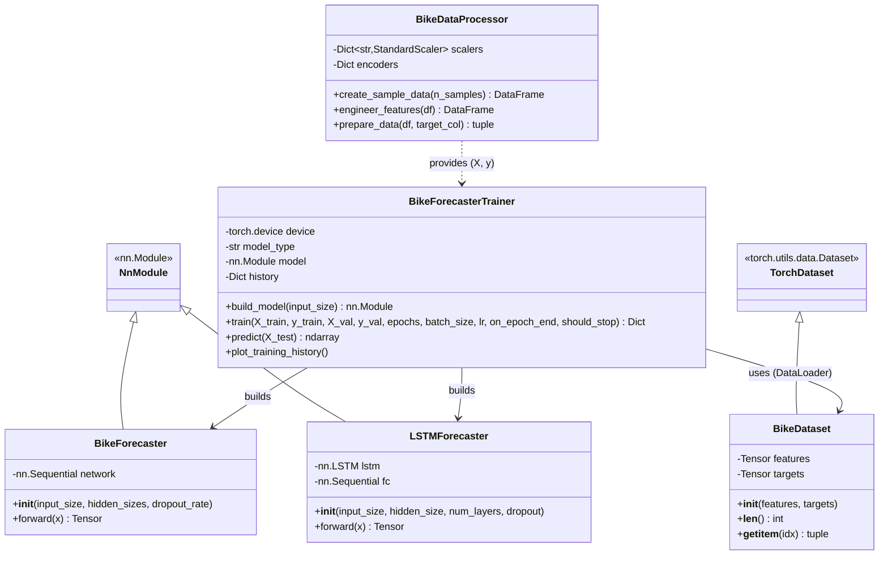
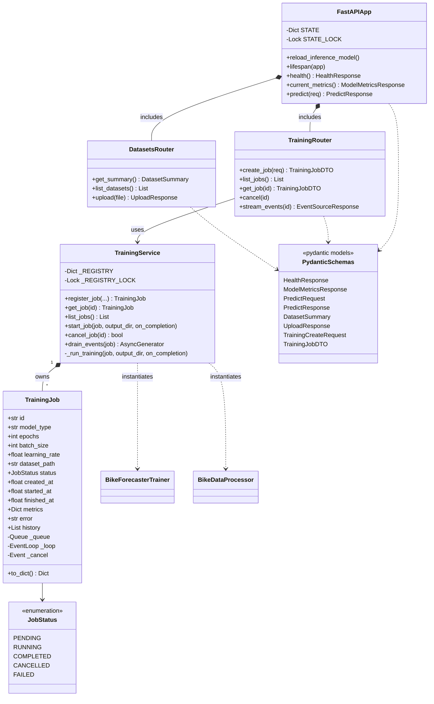
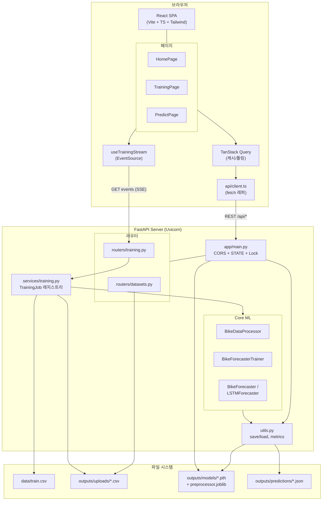
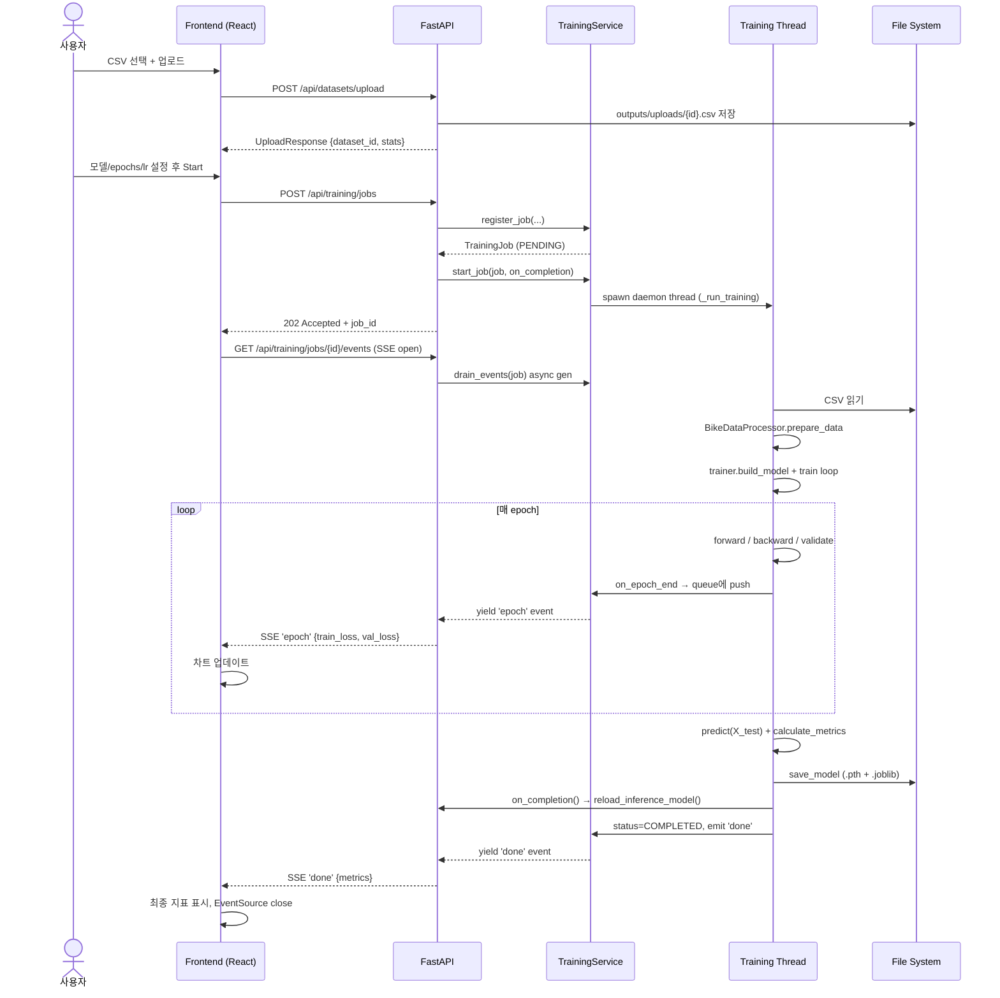
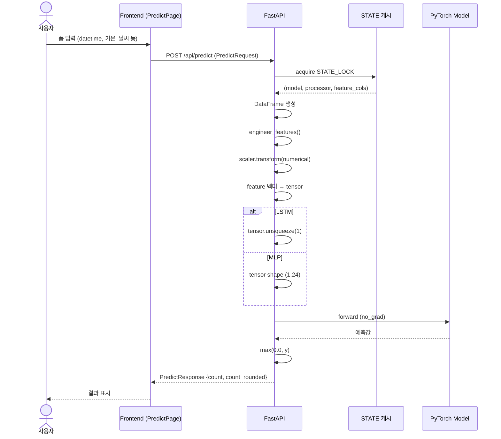
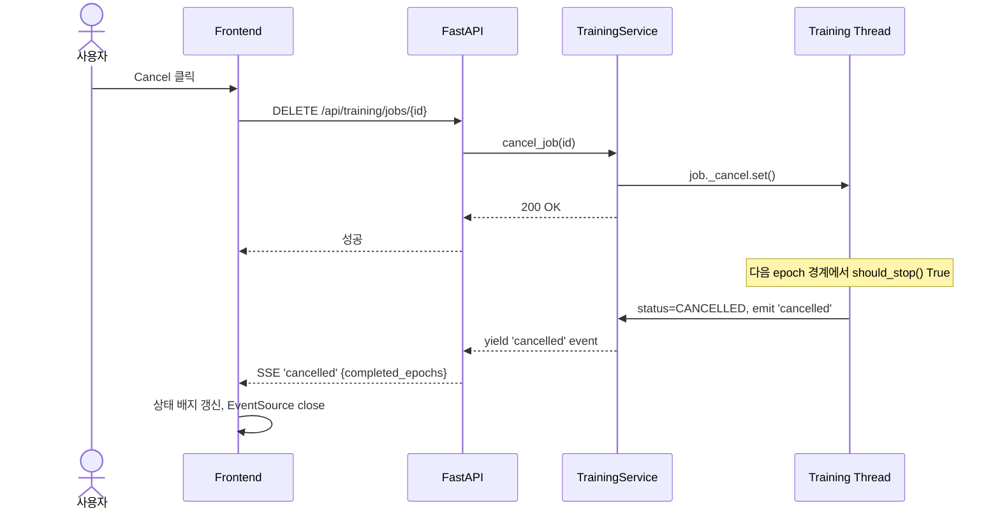
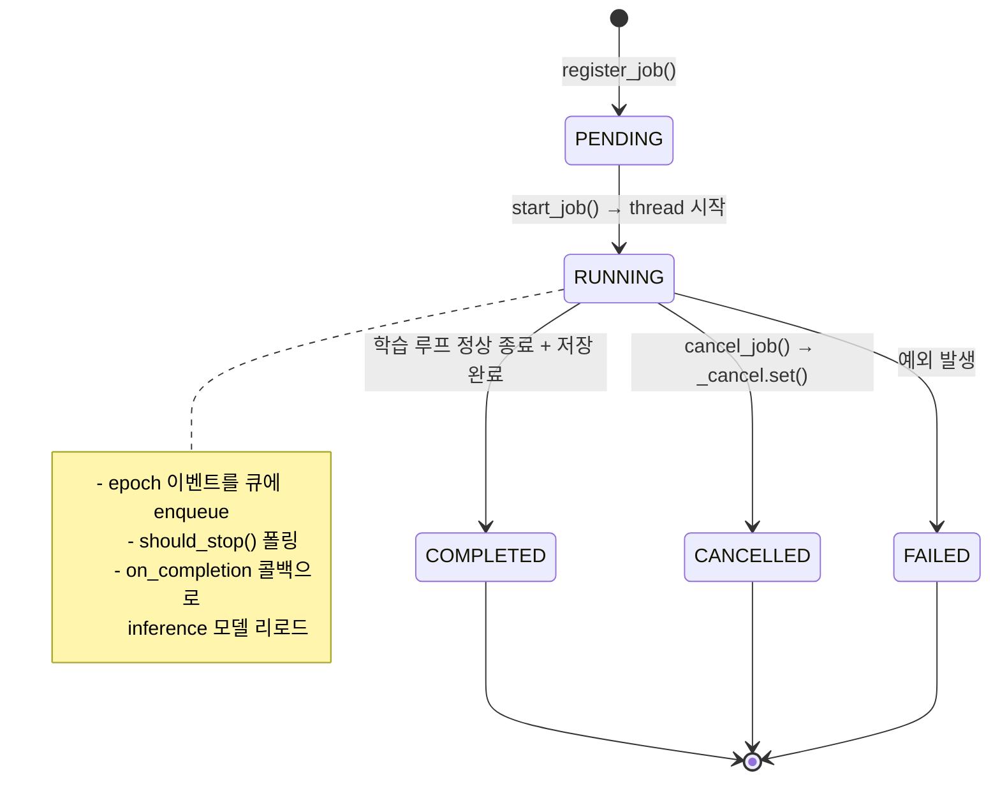
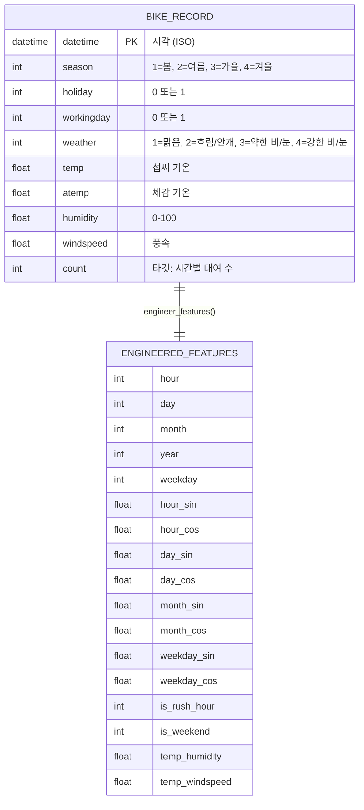
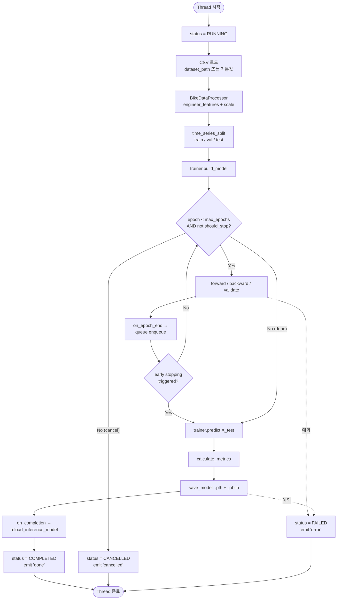
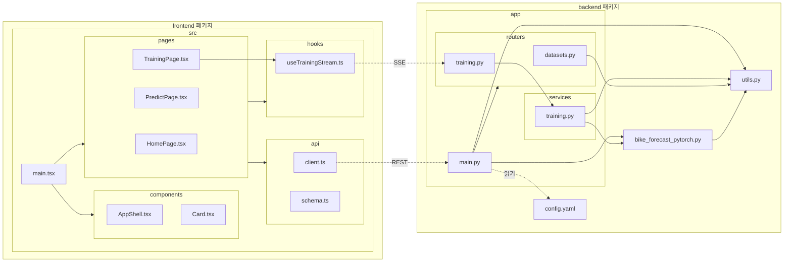

# UML 다이어그램

Mermaid 기반 UML 다이어그램 모음입니다. GitHub/GitLab/VSCode Markdown 프리뷰에서 바로 렌더링됩니다.

## 1. 클래스 다이어그램 — Backend 핵심

## 2. 클래스 다이어그램 — API / 서비스 레이어

## 3. 컴포넌트 다이어그램 — 시스템 전체

## 4. 시퀀스 다이어그램 — 학습 워크플로우

## 5. 시퀀스 다이어그램 — 예측 워크플로우

## 6. 시퀀스 다이어그램 — 학습 취소

## 7. 상태 다이어그램 — TrainingJob 라이프사이클

## 8. ER 스타일 — 데이터 스키마 (CSV 입력)

## 9. 활동 다이어그램 — `_run_training` 내부 플로우

## 10. 패키지 다이어그램

## 11. 렌더링 방법

- **GitHub/GitLab**: `.md` 파일을 직접 열면 Mermaid 블록이 자동 렌더링됩니다.
- **VSCode**: "Markdown Preview Mermaid Support" 확장 설치 후 프리뷰(Ctrl+Shift+V).
- **IntelliJ / PyCharm**: Markdown 툴 창에서 Mermaid 지원 플러그인 활성화.
- **정적 사이트**: MkDocs-Material, Docusaurus 등 대부분의 도구가 Mermaid를 기본 지원합니다.
